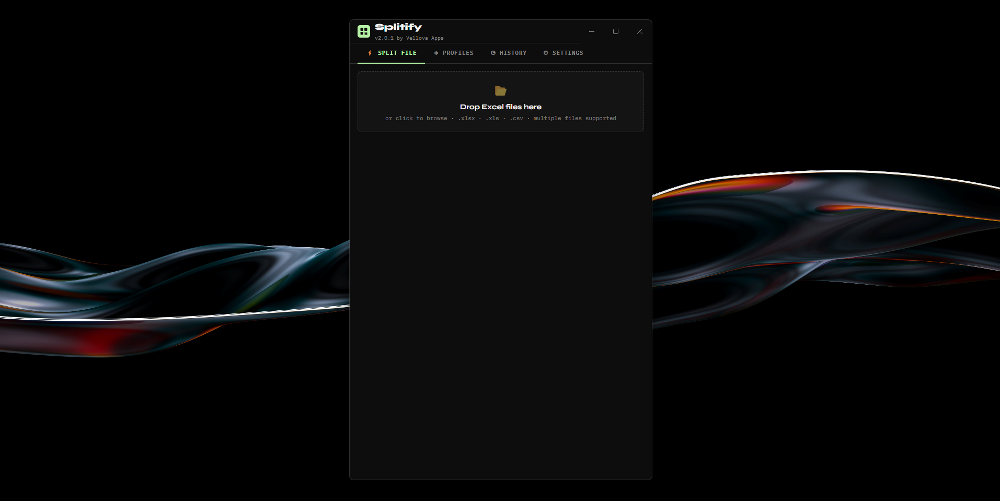
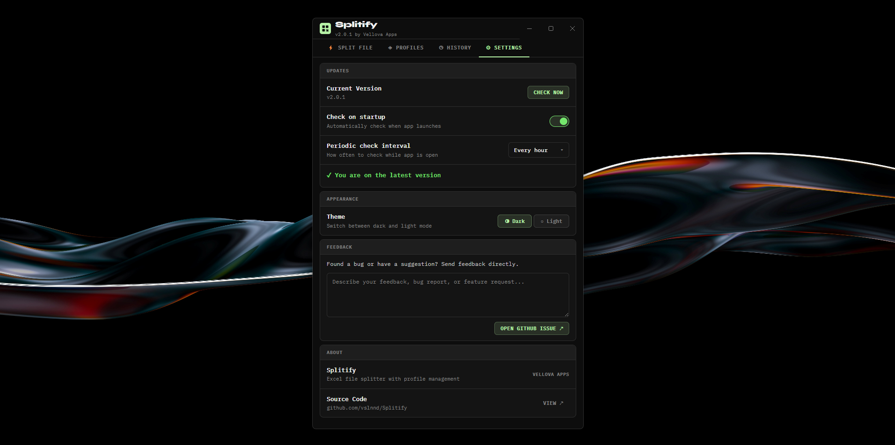
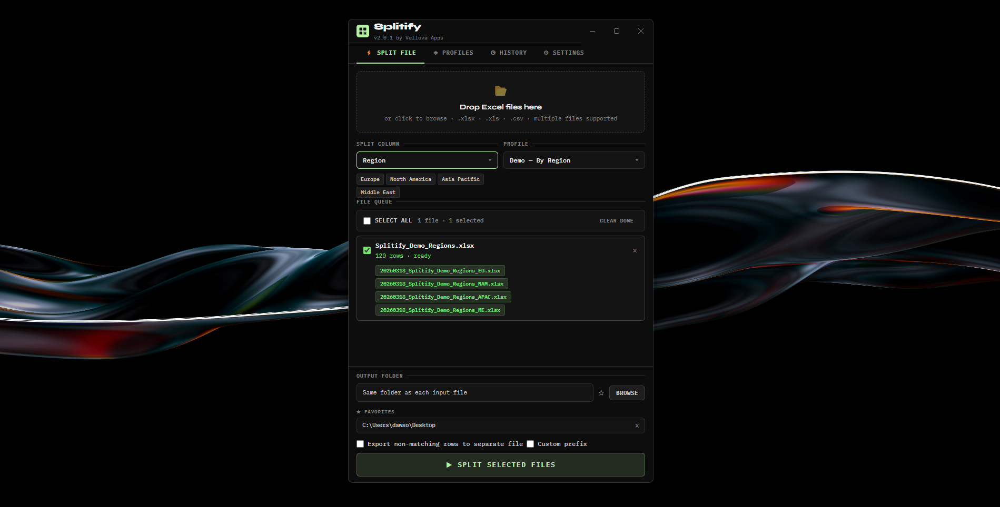

# Splitify

**Split Excel and CSV files based on a value, row condition, or rule you define.**

Splitify scans your file, finds the condition you set, and splits it into separate output files automatically. Save your configurations as profiles and reuse them in one click — no repeating setup every time.

> Part of the [Vellova Apps](https://github.com/vslnnd) suite.

---

## Features

- Split by value, row, or custom condition
- Profile management — save, load, and switch between configurations
- Auto-updates — new versions install silently in the background
- Windows support

---

## Screenshots

**Drop zone — drag and drop any Excel or CSV file to get started**


**Profiles — save your split configuration and reuse it in one click**


**Settings — manage updates, appearance and send feedback directly**


**File queue — preview exactly which output files will be created before splitting**


---

## Download

Get the latest version from the [Releases](../../releases/latest) page.

| Platform | File |
|----------|------|
| Windows | `.exe` installer |

No setup required — download, install, open.

---

## For developers

```bash
npm install
npm start
```

---

*Built by [Nenad](https://github.com/vslnnd) · Vellova Apps*
