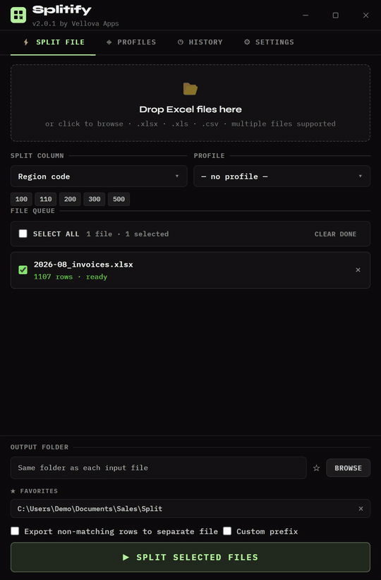

# Splitify

**Split Excel and CSV files into separate files by the values in a column.**

Drop in one or more files, pick the column to split by and a profile that says which values belong together, and Splitify writes one file per group. You see every output file before anything is written, and your setups are saved as profiles, so the next split takes one click.

> Part of the [Vellova Apps](https://github.com/vslnnd) suite · [See it on my portfolio](https://nenad.vercel.app/splitify/)

---

## Features

- Split one or many Excel and CSV files at once, by the values in any column
- Preview every output file before anything is written
- Profiles decide which values are included and how they are grouped; save, import and export them
- Optionally put the rows that match nothing into a file of their own
- A history of every split, with one-click re-runs
- Auto-updates that install in the background

---

## See it in action

<table>
  <tr>
    <td width="45%" valign="middle">
      <h3>Split a file</h3>
      <p>Drop any Excel or CSV file, choose the profile and the column to split by, and preview exactly which output files will be created, before anything is written.</p>
    </td>
    <td width="55%" align="center">
      
    </td>
  </tr>
  <tr>
    <td width="45%" valign="middle">
      <h3>Profiles</h3>
      <p>Save a split configuration and reuse it in one click.</p>
    </td>
    <td width="55%" align="center">
      
    </td>
  </tr>
  <tr>
    <td width="45%" valign="middle">
      <h3>New profile</h3>
      <p>Name it, describe it, and set exactly which parameters are included, or import parameters from a similar profile.</p>
    </td>
    <td width="55%" align="center">
      
    </td>
  </tr>
  <tr>
    <td width="45%" valign="middle">
      <h3>History</h3>
      <p>Every split, with detailed output for each file.</p>
    </td>
    <td width="55%" align="center">
      
    </td>
  </tr>
  <tr>
    <td width="45%" valign="middle">
      <h3>Re-run</h3>
      <p>Split the same files again straight from history, as long as they are still on the same path.</p>
    </td>
    <td width="55%" align="center">
      
    </td>
  </tr>
  <tr>
    <td width="45%" valign="middle">
      <h3>Settings</h3>
      <p>Manage updates and appearance, or send feedback to the developer.</p>
    </td>
    <td width="55%" align="center">
      
    </td>
  </tr>
</table>

---

## Download

Get the latest Windows installer from the [Releases](../../releases/latest) page. Run it, and Splitify keeps itself up to date from then on.

---

## For developers

```bash
npm install
npm start
```

---

*Built by [Nenad](https://github.com/vslnnd) · Vellova Apps*
